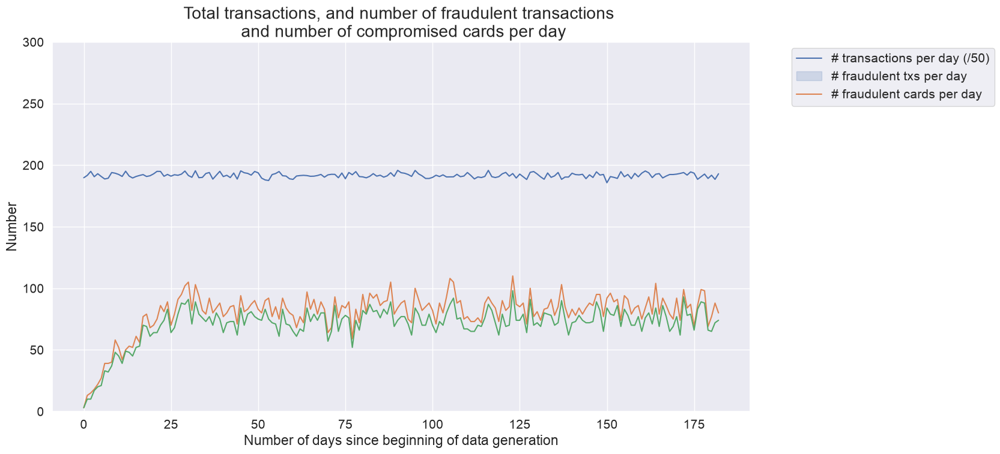
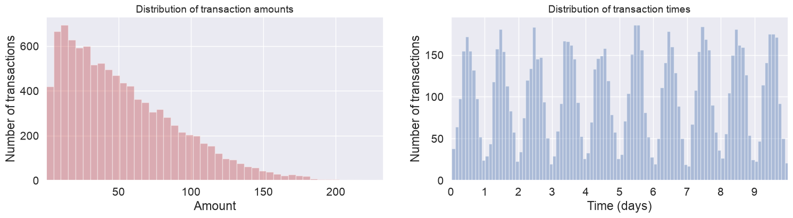
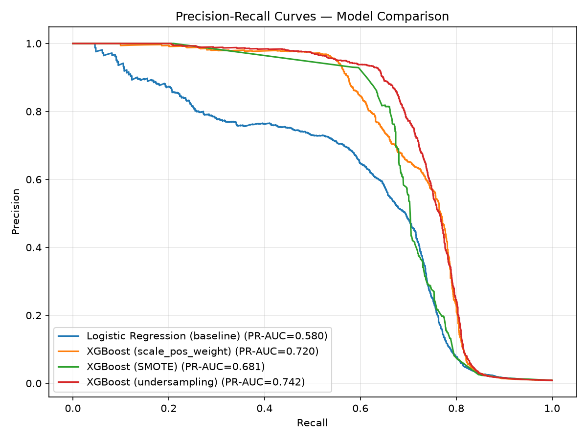
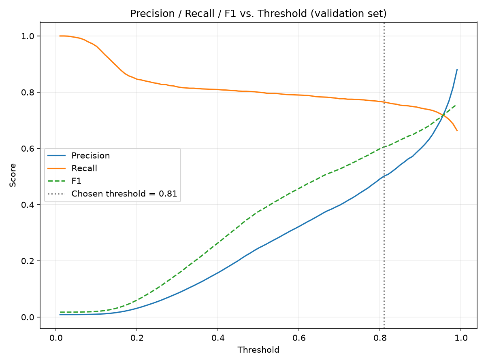

# Fraud-Detection

A fraud detection pipeline built on a simulated payment card dataset. Covering data generation, time-aware feature engineering, model comparison under class imbalance, and threshold selection for a realistic operating point.

## Why simulated data

The commonly-used [Kaggle credit card fraud dataset](https://www.kaggle.com/mlg-ulb/creditcardfraud) is PCA-anonymized (`V1`–`V28`), which strips out customer IDs, terminal IDs, and interpretable timestamps. That makes it impossible to build behavioral features such as a customer's typical spending pattern or a terminal's recent risk history, which is where most of the signal in real fraud detection systems comes from. Additionally, it only spans two days, excluding time-dependent fraud scenarios.

This project, as recommended by the Fraud Detection Handbook, instead simulates ~1.75M transactions from scratch across 5,000 customers and 10,000 terminals over 183 days, with three fraud scenario types injected (random high-amount fraud, compromised terminals, compromised cards). This addresses the drawbacks with the Kaggle dataset at the cost of two limitations:

- **No guarantee the simulated fraud patterns match real-world fraud statistically.** Results here demonstrate methodology, not a validated real-world fraud rate or feature set. The dataset won't have captured the extent of the complexity in true fraud scenarios and contexts.
- **The data can't be benchmarked against published results**, unlike the Kaggle dataset, where thousands of public notebooks provide a reference point for whether a given PR-AUC is reasonable.

### Fraud scenarios simulated

| Scenario | Rule | What it simulates |
|---|---|---|
| 1 — Amount threshold | Any transaction over 220 is fraud | Not based on a real pattern - an obvious signal any baseline detector should catch, used to validate the implementation of a fraud detection technique. |
| 2 — Compromised terminal | Each day, 2 random terminals are drawn; all transactions on them for the next 28 days are fraud | Simulates a compromised terminal (e.g. phishing/skimming). Detectable via terminal-level fraud-rate features; the 28-day window means the signal appears and disappears over time, so it also tests whether the model handles temporary, localised risk. |
| 3 — Compromised card | Each day, 3 random customers are drawn; over the next 14 days, 1/3 of their transactions have the amount multiplied by 5 and are marked fraud | Simulates card-not-present fraud from leaked credentials: the customer keeps transacting normally while a fraudster makes larger transactions on the same card. Detectable via customer spending-habit features; like scenario 2, the temporary 14-day window tests handling of a risk signal that fades. |

*Transactions, fraudulent transactions, and compromised cards per day — stabilizes after an initial ~30-day ramp-up as scenario-based fraud (14/28-day recurring compromise patterns) reaches steady state.*

*Transaction amounts follow a right-skewed distribution; transaction times show a clear daily cycle, both by design of the simulator.*

## Feature Engineering

| Feature | Method | Rationale |
|---|---|---|
| Transaction datetime | One-hot encoding: `TX_DURING_WEEKEND`, `TX_DURING_NIGHT` | Fraud rates differ by time context; simple binary flags avoid overfitting a full datetime encoding. |
| Customer ID | RFM (Recency, Frequency, Monetary value): characterises customer spending through transaction count and average amount per customer over 1/7/30-day windows | Captures a customer's *recent normal* so a transaction is judged against their own baseline, not a global average. |
| Terminal ID | Risk encoding: the average number of fraud cases per terminal over 1/7/30-day windows, with a delay period to reflect label-confirmation latency | Terminals that were recently compromised stay elevated for a period even after detection lag, mirroring how compromised-terminal fraud clusters in time and location. |

All rolling features are computed **time-aware**: each transaction sees data from the defined windows before it (plus a delay buffer for terminal risk), never future information which avoids lookahead leakage.

## Modeling Approach

**Split:** time-based train (90d) → delay (7d) → validation (20d) → delay (7d) → test (26d), using the most recent 150 of 182 days (avoiding the first month). The delay periods simulate fraud-label confirmation latency and prevent training on labels that wouldn't yet be known at prediction time.

**Models compared:**
- Logistic Regression (`class_weight='balanced'`) as an interpretable baseline
- XGBoost with three imbalance-handling strategies: `scale_pos_weight`, SMOTE oversampling, and random undersampling — each with early stopping driven by validation PR-AUC

**Why PR-AUC, not ROC-AUC or accuracy:** with fraud at ~0.88% of transactions, accuracy is meaningless (predicting "no fraud" scores >99%) and ROC-AUC is inflated by the huge volume of easy true negatives. PR-AUC isolates how well the model ranks fraud above legitimate transactions.

**Model selection and threshold tuning happen on the validation set only**

## Results

| Model | PR-AUC | ROC-AUC |
|---|---|---|
| Logistic Regression (baseline) | 0.580 | 0.895 |
| XGBoost (scale_pos_weight) | 0.720 | 0.894 |
| XGBoost (SMOTE) | 0.681 | 0.893 |
| **XGBoost (undersampling)** | **0.742** | 0.897 |

XGBoost with undersampling was selected on validation PR-AUC and evaluated once on the held-out test set:

- **Test PR-AUC: 0.737** / **Test ROC-AUC: 0.902** — consistent with validation (0.742 / 0.897), confirming no leakage from model selection.
- **Card-Precision@85** (if analysts review the top ~85 flagged transactions/day, matching the simulated daily fraud volume): **71.3%** on test vs. 71.5% on validation.

SMOTE was the weakest imbalance-handling strategy, stopping after only 12 boosting rounds. This is likely because interpolating between three structurally different fraud scenarios (random high-amount, compromised terminal, compromised card) produces synthetic points that don't represent any real fraud pattern well.

### Threshold selection

The default `threshold=0.5` is not a principled choice for this class balance — it yields only 23% precision (flags 3x more transactions than the true fraud rate warrants). A threshold sweep on the validation set, with a stated business constraint of **precision ≥ 50%**, selected `threshold=0.81`:

| Threshold | Precision | Recall | Flagged / 249,527 test tx |
|---|---|---|---|
| 0.50 (default) | 23.1% | 79.4% | 7,557 |
| **0.81 (chosen)** | **48.5%** | **76.5%** | 2,197 |

At the chosen threshold, roughly 1 in 2 flagged transactions is genuine fraud, catching 76.5% of all fraud, versus flagging nearly 3.5x more transactions for only a small recall gain at the default threshold.

## Future Work & Real-World Considerations

- **Rolling/walk-forward validation** across multiple time windows, to measure concept drift. This project avoids drift by design, but a production system working with real data would need evidence of temporal stability.
- **Explainability**: SHAP values per flagged transaction, so a reviewed case has a stated reason, not just a score.
- **Cost-sensitive threshold selection**: link the threshold to an estimated cost of a missed fraud vs. the investigation time, rather than the minimum precision method.
- **Graph-based features**: shared terminals across customers, terminal clustering, to better capture compromised-terminal fraud propagation.
- **Retraining cadence**: real fraud patterns evolve as fraudsters adapt to detection; a deployed version would need scheduled retraining and drift monitoring, neither of which is meaningful to simulate here.
- **Validation against real-world benchmarks**: results here demonstrate methodology on data with known conditions; deploying against real transactions would require revalidating design choices (window sizes, delay periods, imbalance strategy) against actual fraud statistics.